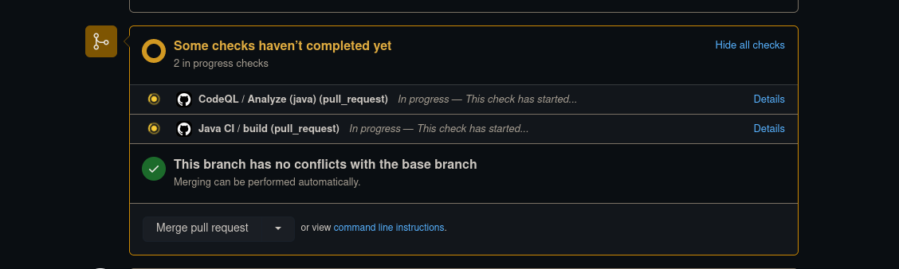
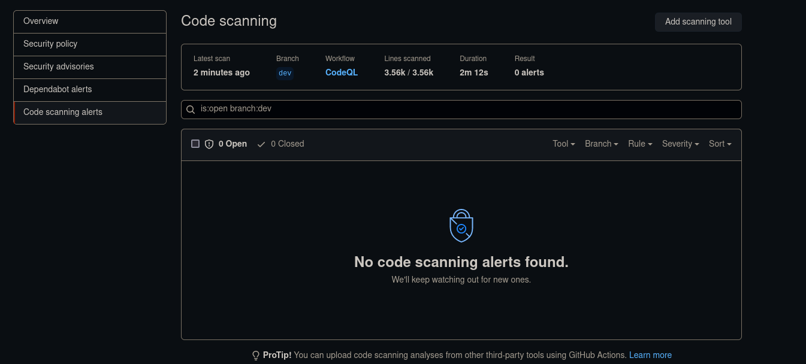
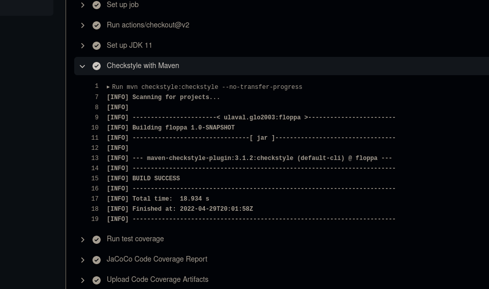
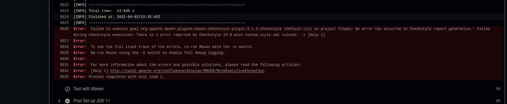
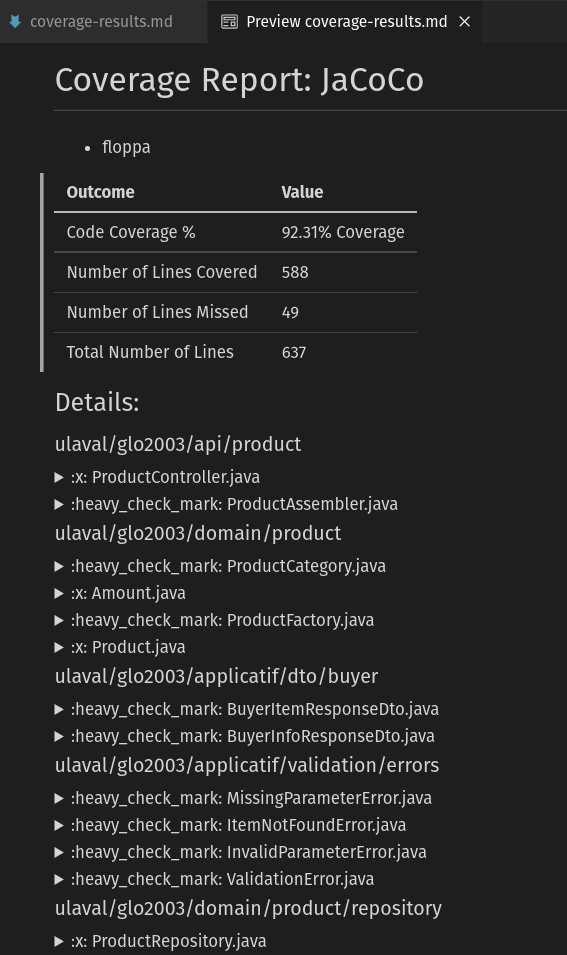
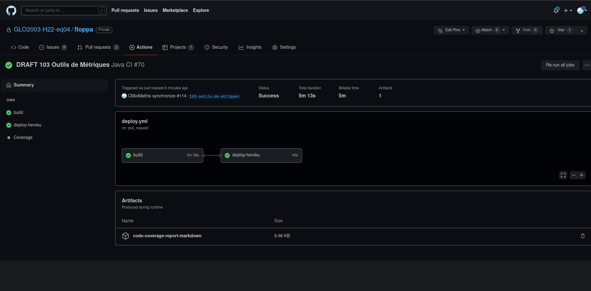

# TP4

## Open Source Execution

>2 - Comme licence, nous avons choisi "Boost Software License", parce que le projet étant un travail scolaire
> les compagnies, les potentiels contributeurs et les utilisateurs aurons un accès libre au code source et pourrons modifier
> le code librement. 
> De plus, bien que cette licence est assez libre d'utilisation, les utilisateurs devrons garder une copie de la licence 
> utilisée, alors nous sommes assurés que l'application reste open source.
> Finalement, nous informons les potentiels utilisateurs que le code fourni n'est aucunement garantie.

## Questions open source
### Avantages :
Évite de coder plusieurs fois le même code pour résoudre un même problème.

Permet de recevoir le soutien de la communauté pour le projet.

Sécurise l’application, car le open source permet d’exposer plus facilement des failles.
### Défis:
Les gestionnaires du dépôt ont plus de travail, car ils doivent réviser avec grande attention le code qui est proposé parce qu'il provient d’inconnus.

Des efforts supplémentaires doivent être utilisés pour s’assurer que la vision du projet reste la même. Par exemple, il faut activement communiquer avec la communauté pour s’assurer d’être sur la même page sur la direction du projet.

Il est possible que des acteurs malveillants veulent intentionnellement introduire du code vulnérable. Il y a donc un défi de vérifier attentivement le code reçu par plusieurs personnes pour assurer sa sécurité.

### Information surprenante
Le côté légal est pas mal plus développé qu'attendu. Par exemple, il y a beaucoup de types de licences et de problèmes judiciaires liés au changement de cette licence.

## Outils metriques
Tous les outils sont exécuté lorsqu'une pull-request est crée et mise à jour.
### Sécurité

Nous avous choisi l'outil CodeQL qui permet de faire des rapports sur les vulnérabilités dans les librairies utilisés.




### Qualité de code
Nous avous utilisé un nouvel outil de vérification de style de code et enforcé que le code utilise le style forni dans ```custom-style.xml```.




### Couverture de tests
Lorsque la pipeline de tests est exécutée, un rapport de couverture de test est publié avec les artifacts de la pipeline.





## Retrospective

1. La première problématique est que l’équipe avait de la difficulté à estimer le temps restant pour effectuer les différentes tâches. La solution serait d’introduire une étape de poker planning lors de la division des tâches. Cela permettrait donc d’avoir la vision de l’ensemble de l’équipe sur la durée estimée d’une tâche et donnerait donc des estimations plus véridiques. La deuxième problématique est que notre processus se basait sur des rencontres d’équipes hebdomadaires pour communiquer le progrès et s’entraider. Le problème est que nos horaires étaient hautement variables et par conséquent, souvent non-compatibles. La solution serait de retirer ces rencontres hebdomadaires en faveur de petites rencontres courtes qui ne sont pas obligées de comprendre tout le monde de l’équipe. Cela permettrait de s’entraider malgré nos horaires chaotiques.

2. Pour intégrer un nouvel outil technologique, on confiait la tâche à un membre de l’équipe d’aller apprendre ce nouvel outil. Lorsqu’il était devenu familier avec l’outil, il faisait donc un rapport à l’équipe pour les former à l’utilisation de cet outil. 

    Nous n’avons pas vraiment rencontré de bogues lors de l’intégration de nouveaux outils, car ils étaient bien recherchés.

    Nous explorions les nouvelles fonctionnalités à l’aide de tests manuels et unitaires. Les tests manuels étaient plus utilisés initialement pour comprendre le fonctionnement de la technologie utilisée. Dès que le fonctionnement général était compris, nous nous replions sur des tests unitaires pour accélérer le développement.

    Faire des tests automatisés est une excellente façon d’accélérer le développement comme ils sont beaucoup plus rapides que les tests manuels.
    Toutes les features demandées à chaque remise ont été complétées intégralement.

3. Notre équipe à atteint un niveau d’autonomie individuelle assez élevé rapidement.

    La division des tâches était équitable pour toutes les itérations.

4. Le conseil qu’on donnerait est de se prendre tôt pour effectuer le travail, car cela permet de faire un travail de plus haute qualité.

5. Le concept de DevOps était nouveau pour nous, plus particulièrement le déploiement automatisé. Nous avons pu voir les bénéfices que cette approche apporte au projet comme minimiser le temps perdu à déployer manuellement la dernière version de l’application.
Le concept de code review formel était aussi nouveau pour nous. Nous avions l’habitude de ne pas faire de pull request. Ce processus de révision de code a amélioré la qualité du code.


### Captures d'écran

##### Projet


##### Milestone


##### Issue 1


##### Issue 2


##### Issue 3


##### PR 1


##### PR 2


##### PR 3


##### Arbre de commits et de branches


